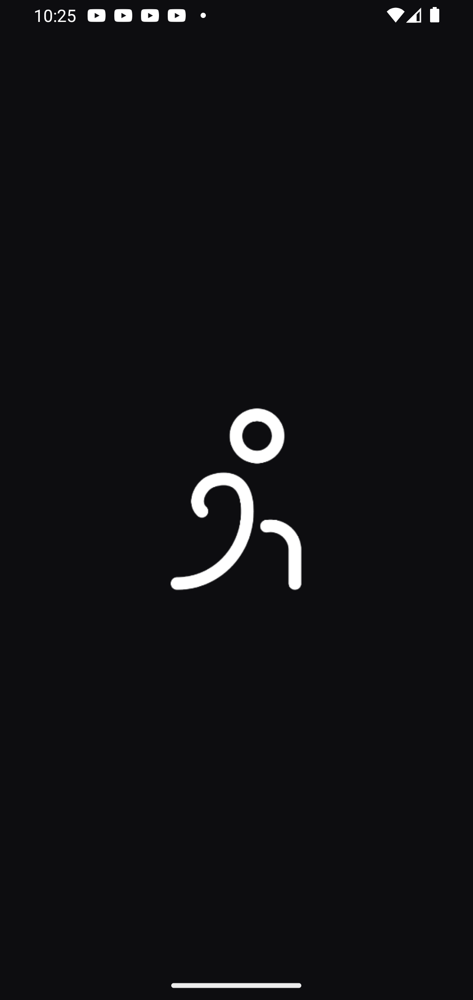
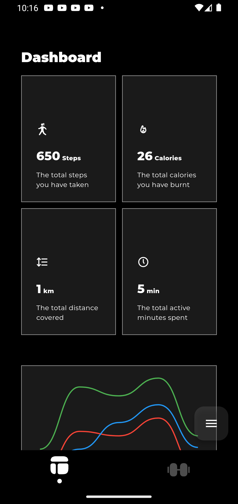
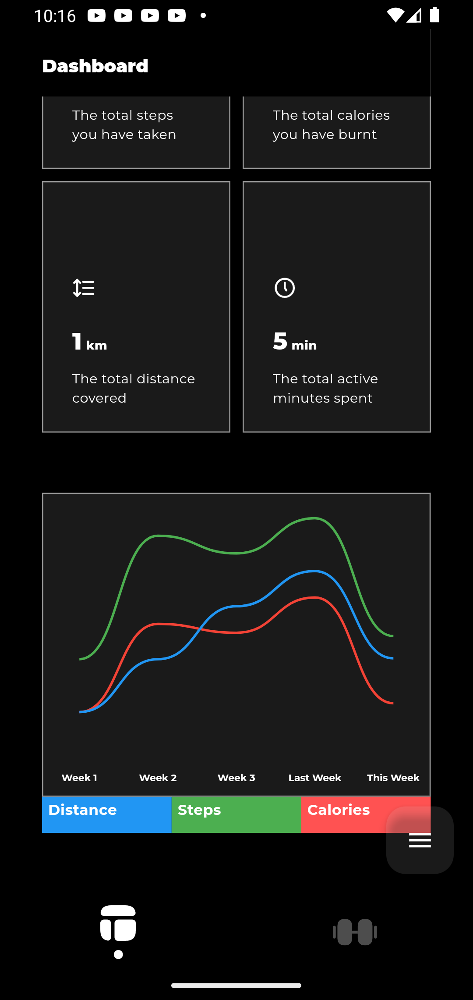
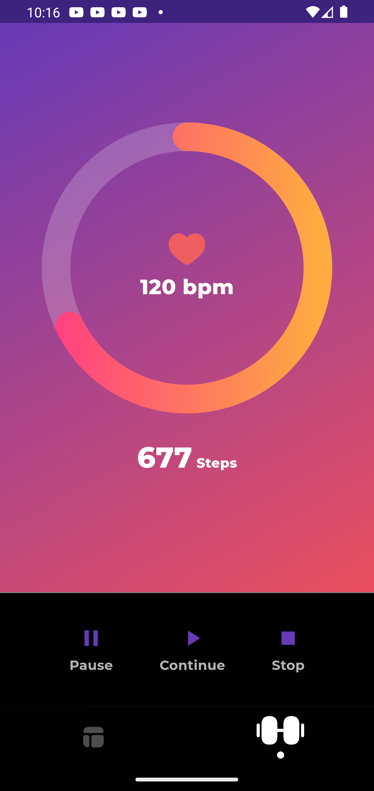

# FitTrack Pro. Flutter + Native Android Fitness Tracker

> 📱 **Real-time fitness stats with native sensor integration and a custom Flutter dashboard**

---

## 🧭 Overview

**FitTrack Pro** is a cross-platform fitness tracking app built using **Flutter** and **native Android (Kotlin)** components. It provides a smooth and modern interface for tracking live workout stats, animated multi-line charts, and full native sensor integration via MethodChannels.

---

## 🧩 Features

- 📊 Real-time dashboard with live stats for:
  - Steps
  - Calories
  - Distance
  - Active Minutes
- 📈 Smooth animated multi-line chart with:
  - Black (Steps)
  - Blue (Distance)
  - Red (Calories)
- 📡 Native sensor simulation for heart rate and steps using `MethodChannel`
- 🕒 Workout timer controlled from Flutter, powered by native Android service
- 🧠 Pull-to-refresh, morphing FAB, haptic feedback, and responsive UI
- 🎨 Custom Sliver layout with interactive stat cards and tooltips

---

## 🚀 Architecture Overview

### Flutter

- **DashboardPage**
  - Real-time stat cards via `sensorUpdate` channel
  - Custom `CustomChart` widget auto-generates weekly data
  - Live updates for “This Week” data from background service
  - Uses `CustomScrollView`, `SliverList`, and `SliverAppBar`
  - Pull-to-refresh animation triggers new updates

- **WorkoutPage**
  - Native workout timer controlled via `fittrack/workout_timer` channel
  - Timer state updates streamed into Flutter
  - Workout session stats tracked live

### Kotlin (Native Android)

- **SensorService.kt**
  - Simulates or fetches step and heart rate data every few seconds
  - Computes derived metrics like distance, calories, and active minutes
  - Sends updates to Flutter via:
    ```kotlin
    MethodChannel(flutterEngine.dartExecutor.binaryMessenger, "fittrack/sensors")
    ```

- **WorkoutTimerService.kt**
  - Native service for workout duration tracking
  - Communicates with Flutter via `fittrack/workout_timer`
  - Can be started and stopped directly from Flutter UI

---

## 🔌 Permissions

Make sure your Android manifest includes:

```xml
<uses-permission android:name="android.permission.ACTIVITY_RECOGNITION"/>
<uses-permission android:name="android.permission.WAKE_LOCK"/>
<uses-permission android:name="android.permission.FOREGROUND_SERVICE"/>
```

---

## 📁 Directory Structure

| Path | Purpose |
|------|---------|
| `lib/views/dashboard_page.dart` | Main screen showing real-time stats and chart |
| `lib/views/workout_page.dart` | UI and logic for workout sessions |
| `lib/widgets/custom_chart.dart` | Animated, real-time, curved multi-line chart |
| `android/MainActivity.kt` | Sets up Flutter ↔ Native `MethodChannel` connections |

---

## 📊 Real-Time Chart (CustomChart)

- Uses simulated weekly data internally (Week 1 → "This Week")
- Animated from 0 to actual values using `TweenAnimationBuilder`
- Real-time updates from native Kotlin via `sensorUpdate` channel
- Tooltips on touch show per-week values
- Each week has 3 smooth lines:
  - ⚫ Steps (Black)
  - 🔵 Distance (Blue)
  - 🔴 Calories (Red)

---

## 🛠 How to Run

1. Clone the repo
2. Connect Android device or use emulator
3. Run:
   ```bash
   flutter pub get
   flutter run
   ```

---

## 🧪 Testing

- Use `adb logcat` to debug native logs
- Background services simulate updates if real sensors are unavailable
- Add real sensor logic in `SensorService.kt` to extend for production

---

## 📈 Screenshots

| Splash Page                               | Dashboard Page                                   | Weekly Chart                                 | Workout Page                                    |
|-------------------------------------------|--------------------------------------------------|----------------------------------------------|-------------------------------------------------|
|  |  |  ||

---

## 📦 Screen Recording

> 🔗 [Watch Screen Recording here](recording.mp4)

---

## 📦 APK Download

> 🔗 [Download APK Here](fittrack.apk)

---

## 📚 Future Plans

- [ ] Google Fit / HealthKit integration
- [ ] Cloud sync and user profile
- [ ] History of workout sessions
- [ ] Improved battery optimization logic

---

## 🤝 Contributions

Open to pull requests, feedback, or custom extensions. This app is designed for educational and prototyping purposes
# fittrack
